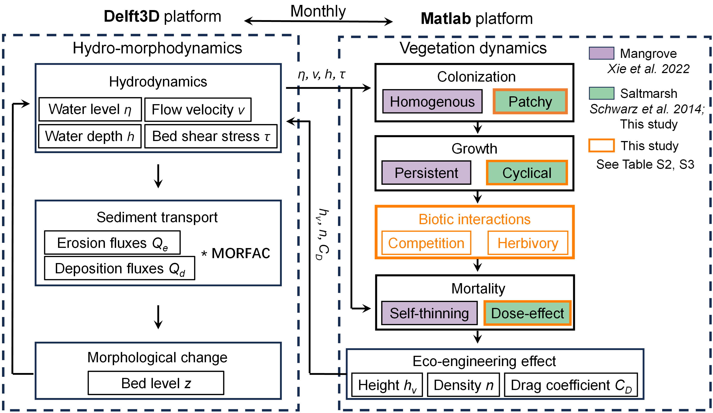
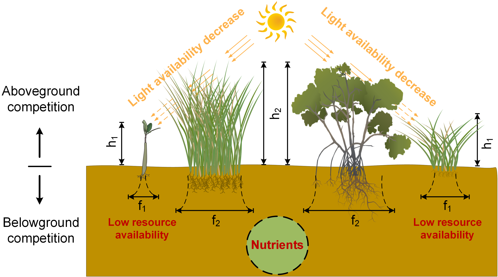
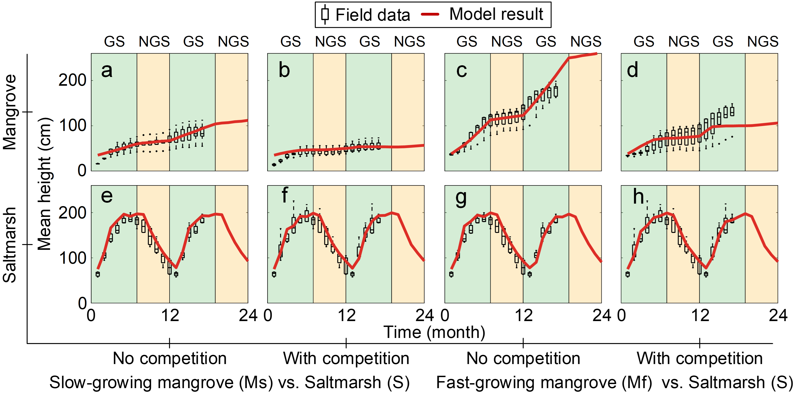

# Mangrove-Saltmarsh-Ecotone
_Mangrove-Saltmarsh-Ecotone_ is a modelling study investigating the effects of biotic interactions (i.e., competition and herbivory) on mangrove-saltmarsh ecotone dynamics and the eco-morphodynamic feedback between vegetation dynamics and morphological changes. 
The research has been published in _Earth's Future_ and can be freely accessed through https://doi.org/10.1029/2024EF004990.
To use the model, please follow the instructions on the [Technical Document](Technical_Documents.pdf).

## Model Highlights
###### 1. Eco-Morphodynamic Feedback Loop

    

  Schematic illustration of eco‐morphodynamic interactions in mangrove‐saltmarsh ecotones.

 

###### 2. Competition Within Mangrove-Saltmarsh Ecotone

    

  Conceptual sketch of aboveground and belowground competition between two neighboring plant species.

 

###### 3. Model Validation

    

  Comparison of initial growth evaluated over a 2‐year period (red line) for mangroves (Ms and Mf) and saltmarsh (S) with and without competition against field experimental data (box plots).

 
